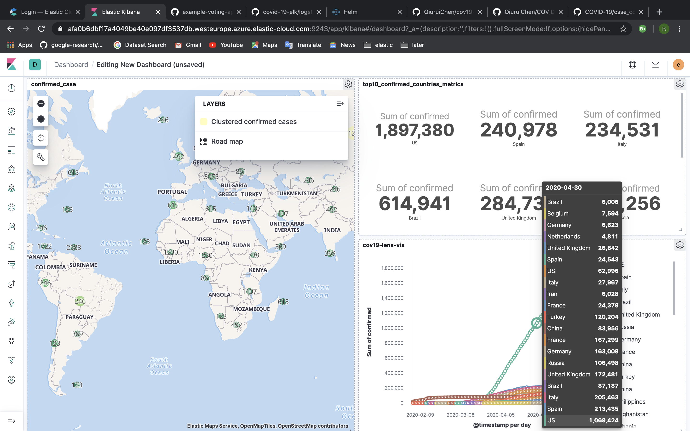

## Covid19 live visualization on Kibana

Simple visualization:


### 1. Set the index template
Open `Dev Tools` in kibana, copy `index-template-mapping.json` content to run.

### 2. Ingest data
```bash
logstash -f logstash-github-covid-19-daily-reportes-temp.conf
```
Fetches time series data from https://github.com/CSSEGISandData/COVID-19/tree/master/csse_covid_19_data/csse_covid_19_time_series.
Upates every hour (at minute 0).


### 3. Visualize on Kibana dashboard

You can import created dashboard or create your new dashboard.

#### Import dashboard
To import, go to `Kibana > Management > Saved Objects`, go to `Import`, select the file then click `Import`.

Warning: trying to import the dashboard into a Kibana version lower than `7.7.0` can lead to unexpected results!

#### Or create your new dashboard

Go to `Kibana> index Patterns> Create index pattern` (Time Filter field name '@timestamp').
Go to visualize to create your graphs.
Go to dashboard to organize your graphs.

Codes are modified from [siscale/covid-19-elk](https://github.com/siscale/covid-19-elk).


